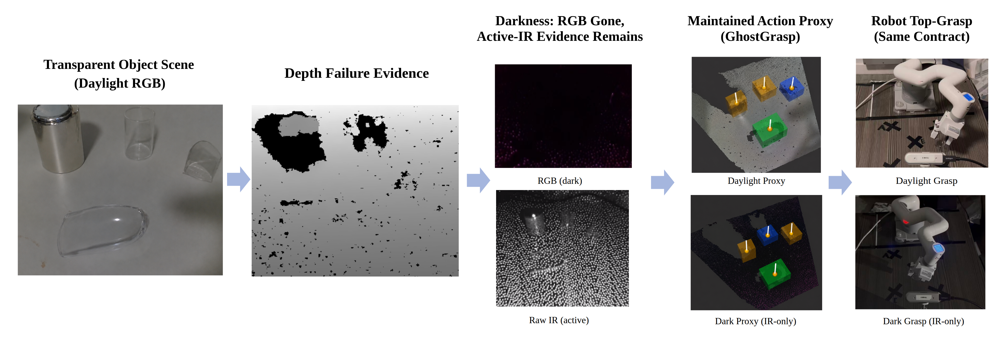
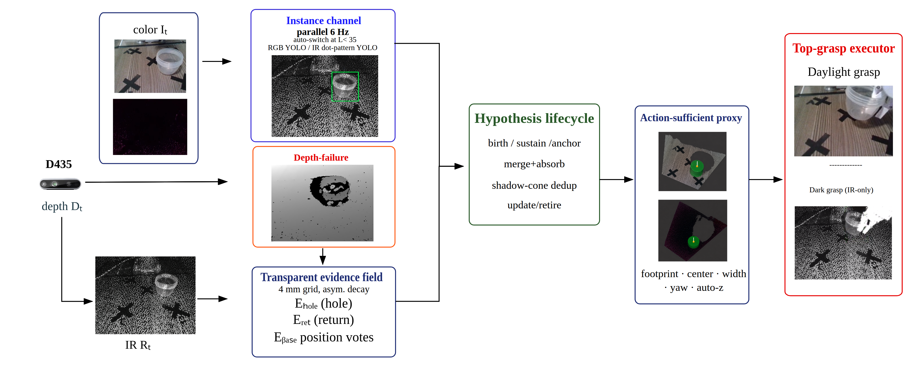
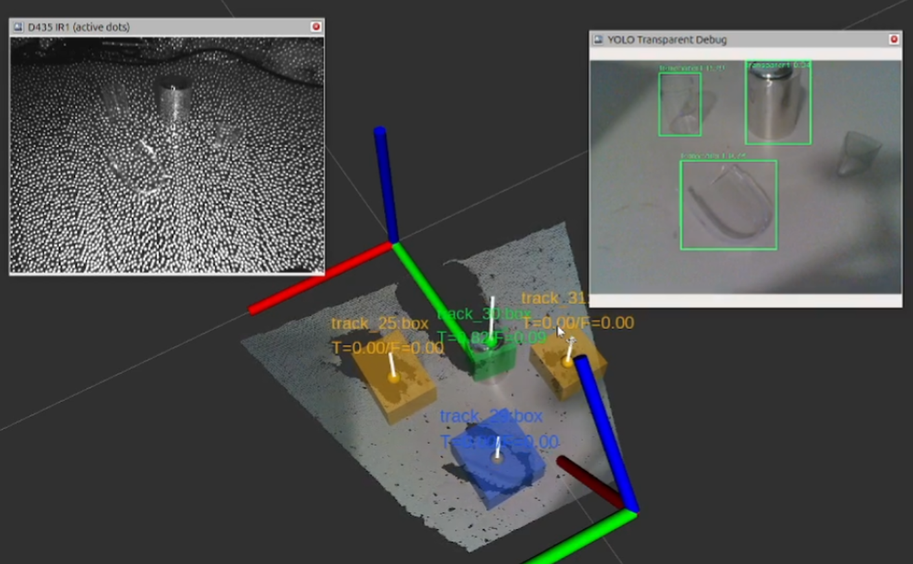
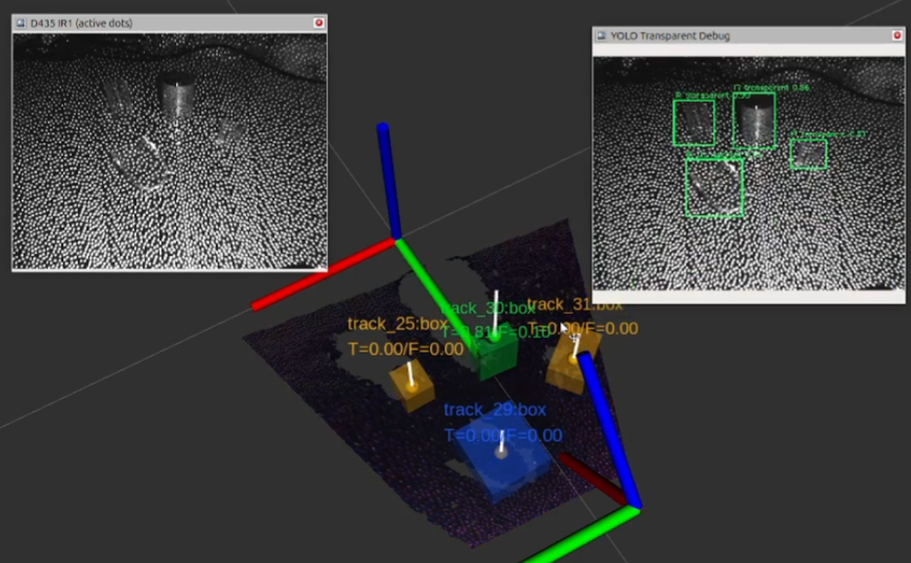
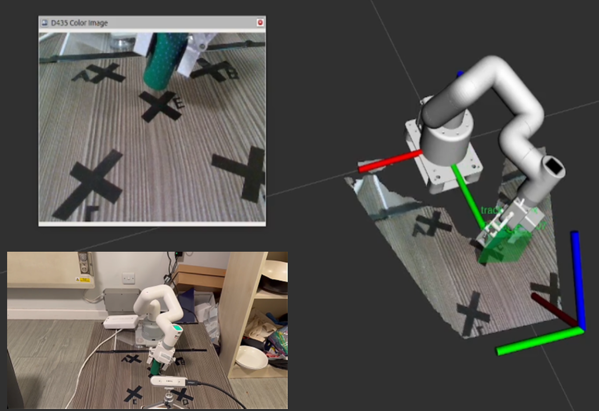
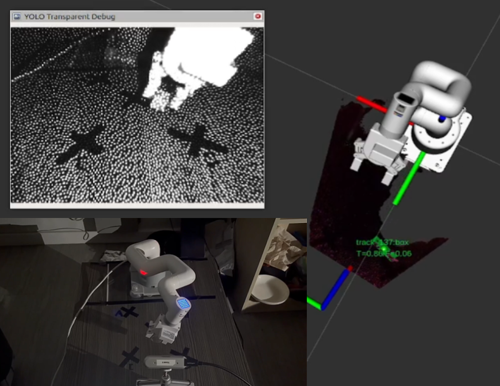
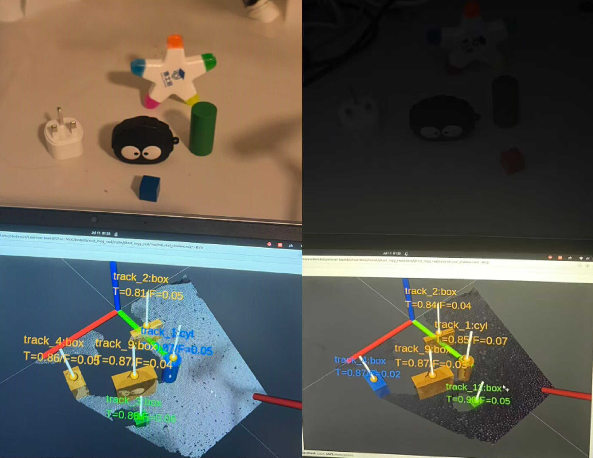
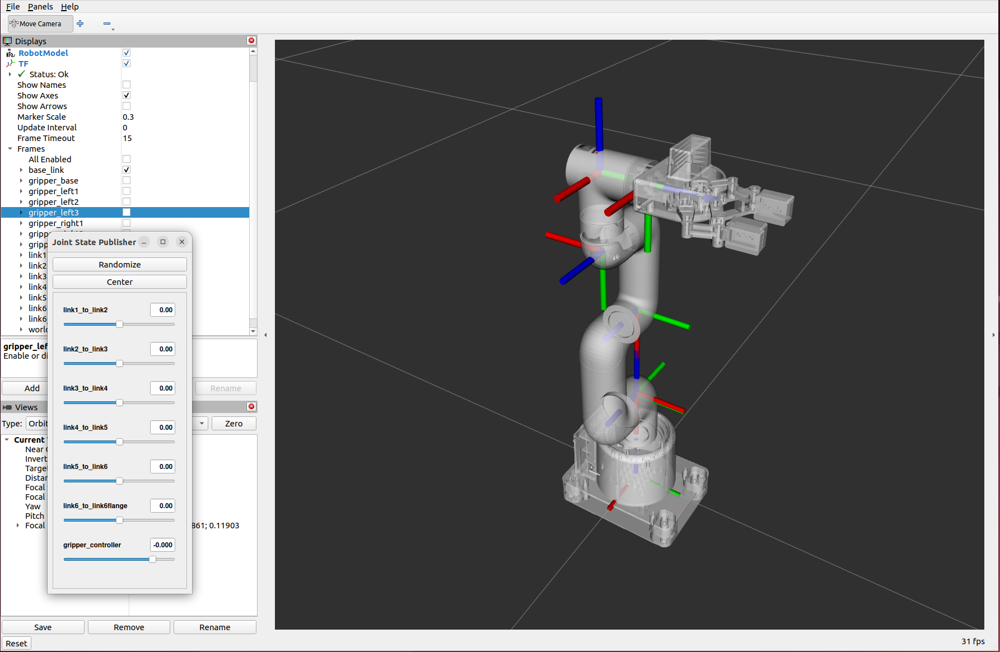
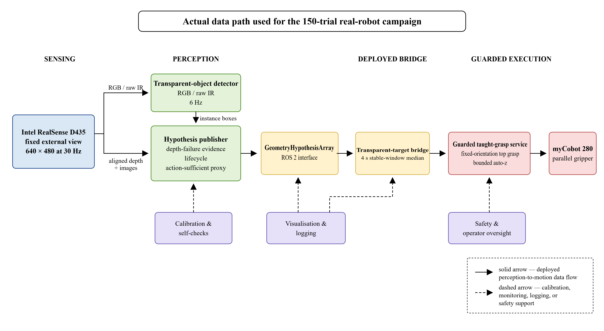

# GhostGrasp

### 从深度失效证据出发，在黑暗中抓取透明物体

**Runfeng Ling — 曼彻斯特大学 MSc Robotics**

[English](README.md) | [简体中文](README.zh-CN.md)

[在 YouTube 观看演示](https://www.youtube.com/watch?v=1ZADqmrzXGo) · [在 Bilibili 观看演示](https://www.bilibili.com/video/BV1yHbq69ERM)

> **发布状态：** 当前仓库仅提供 GhostGrasp 项目介绍和展示图片。论文、源代码、训练模型、配置文件与评测工具将在后续版本中发布。



*GhostGrasp 不把透明物体造成的RGB-D失效简单当作噪声，而是把它们作为物体存在的证据。当可见光RGB消失后，主动红外仍可支持持续的物体假设和相同的顶部抓取任务。*

## 项目简介

透明物体通常会在RGB-D相机中表现为深度空洞、孤立返回，或穿过物体后落在桌面上的错误深度。常见方法会先补全这些深度，再进行抓取规划。GhostGrasp 采用相反思路：保留这些失效，并利用它们在空间和时间上的结构判断物体是否存在。

系统在桌面平面网格上积累深度失效证据，随时间维持物体假设，并把稳定假设转换为包含足迹、中心、夹爪开度、偏航角候选和抓取高度的动作代理。RGB或原始红外检测器可以帮助定位和更新假设，但没有深度证据时，检测框不能单独创建物体。

## 主要结果

最终系统使用固定的 Intel RealSense D435、myCobot 280 和纯CPU感知完成评测。

| 指标 | 明亮环境 | 黑暗环境 |
|---|---:|---:|
| 维持假设的帧覆盖率 | 100% | 96.9% |
| 透明物体抓取成功率 | 34/50（68%） | 35/50（70%） |
| 感知核心运行时间 | 52 ms/帧 | 88 ms/帧 |

- **150次真实机器人实验：** 100次透明物体抓取和50次不透明对照实验。
- **100次透明物体实验中定位失败为0：** 失败均发生在接触之后，主要来自低摩擦滑落或夹爪与物体形状不匹配。
- **纯CPU部署：** 透明物体专用处理耗时8–11 ms，实例检测器以6 Hz异步运行。
- **失效证据不可缺少：** 移除空洞通道后，录制压力场景的覆盖率下降至0–2%。

以上结果对应本文测试的固定视角桌面系统，不代表任意相机、任意场景或任意抓取方式下的性能。

## 方法



系统包含四个主要阶段：

1. **深度失效证据**：深度空洞、孤立/镜面返回和桌面下折射在4 mm桌面网格上为物体存在投票。
2. **适应光照的实例线索**：正常光照下使用RGB，黑暗中使用主动红外点阵图像。检测结果提供身份和位置，但不能单独证明物体存在。
3. **持续假设生命周期**：通过时间积累、滞回、合并、阴影锥去重和退出来维持稳定物体假设，跨越检测丢失和光照切换。
4. **面向动作的抓取代理**：稳定假设直接输出顶部抓取执行器需要的量，不必重建完整物体表面。

## RViz可视化与数字孪生

下面的RViz画面同时显示配准点云、物体代理、坐标系、相机/红外画面和myCobot模型。它们把传感器观测、持续假设和最终机器人目标直观地连接起来。同一套ROS 2接口也用于恢复与执行逻辑的仿真测试。

### 多物体感知

| 明亮环境 | 黑暗环境 |
|---|---|
|  |  |
| 白天由RGB提供实例线索，同时保留点云和主动红外画面。 | 可见光外观消失后，原始主动红外和积累的深度失效证据仍维持四个代理。 |

### 抓取执行画面

| 白天抓取 | 黑暗抓取 |
|---|---|
|  |  |
| 实景窗口和RViz模型共同展示机器人坐标系中的不透明对照抓取。 | 黑暗场景通过原始红外线索维持透明目标，并执行相同的机器人抓取路径。 |

彩色方框是抓取代理，不是重建出来的物体网格。代理的中心和尺寸会被发送到下游抓取接口。

### 桌面杂乱物体



图中左侧为开灯场景，右侧为关灯场景；下方是对应的RViz点云与持续代理。它展示了RGB外观消失后，系统可视化仍然能够维持并显示桌面目标。该场景只作为系统定性展示，不计入透明物体抓取总数。

### 机器人模型验证

<p align="center">
  
</p>

在感知目标接入机器人规划和执行之前，项目先在RViz中检查了myCobot 280 URDF、夹爪关节和TF坐标系。该模型是仿真测试和仅规划检查所使用的数字机器人。

## 机器人系统集成



真实机器人最终使用的数据通路为：

```text
geometry hypothesis → bridge → guarded taught-grasp service → myCobot
```

感知结果通过统一的ROS 2假设接口传递。受保护执行器会检查目标时间、运动使能、抓取高度边界和低速执行条件，然后才向机器人发送命令。全部150次实验均使用这条真实执行通路。

## 演示视频

- [YouTube — GhostGrasp 演示](https://www.youtube.com/watch?v=1ZADqmrzXGo)
- [Bilibili — GhostGrasp 演示](https://www.bilibili.com/video/BV1yHbq69ERM)

视频包含明亮与黑暗抓取、主动红外观测、持续假设、光照切换、多物体感知和典型失败案例。

## 当前适用范围

GhostGrasp 当前面向固定视角、室内桌面感知和单目标顶部抓取。实际执行器使用物体标称高度自动确定抓取高度。移动相机、侧向抓取和高密度杂乱场景不属于本文评测范围。

后续工作包括执行系统已经输出的偏航角和夹爪开度、加入接触反馈减少滑落、在更多主动双目相机和场景中验证，以及在缺少标称高度时通过多视角估计物体高度。

## 仓库状态

当前公开目录暂时**不包含完整实现**。计划发布的内容包括：

- ROS 2感知、接口、桥接和受保护执行包；
- 证据场与假设生命周期实现；
- launch文件和冻结的部署配置；
- RGB/原始红外检测模型权重；
- 回放、消融、运行时间和评测脚本；
- 固定视角桌面系统的复现文档。

代码发布时会同时补充安装说明和软件许可证。

## 引用

论文公开后将在这里补充正式引用信息。在此之前，可以暂时引用MSc学位论文：

```bibtex
@mastersthesis{ling2026ghostgrasp,
  author = {Runfeng Ling},
  title  = {GhostGrasp: Grasping Transparent Objects in Darkness from Depth-Failure Evidence},
  school = {The University of Manchester},
  type   = {MSc dissertation},
  year   = {2026}
}
```

## 联系方式

仓库正式发布后，请通过GitHub Issue提出项目相关问题。
